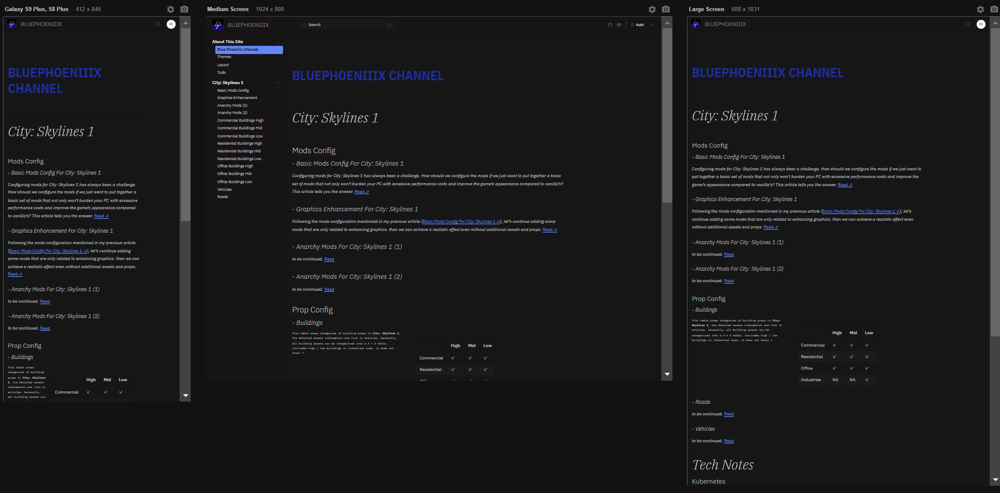
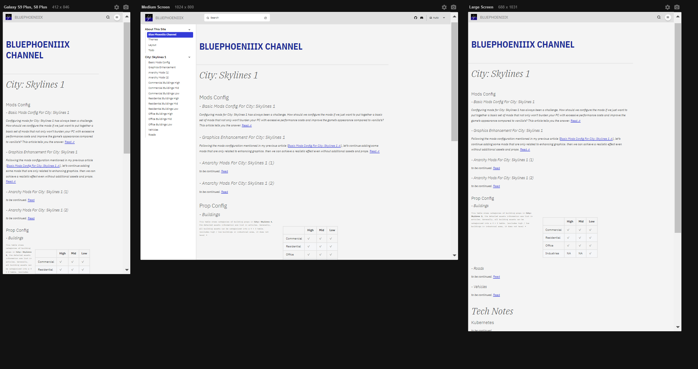

# Astroplex
An optimized theme from Astro Starlight

## Features

### Optimized Typography

- Adjusted widths of main text in the central area to create a more compact view effect
- Replaced Roboto fonts with IBM Plex font families
- Minor adjustments to phone viewport

### Optimized Theme 

- Theme modifications inspired by IBM Carbon Design Light/Dark Theme

### Optimized Images Layout

- Created a 7:3 flex basis layout for paragraph-linked images

```jsx
<section style={{ display: 'flex' }}>
  <div style={{ flexBasis: '70%', paddingRight: '20px' }}>
    <p>
        $p(x;\theta)$, $p_\theta(x)$ - Prior/initial/underlying probability distribution for state $x$ with model parameters $\theta$ <br>
        $q(x;\theta)$, $q_\theta(x)$ - Posterior/updated/predicted probability distribution for state $x$ with model parameters $\theta$ <br>
        $p(x|y)$ - Conditional probability distribution of state $x$ given state $y$  <br>
        $\mathcal{N}(\mu,\sigma^{2})$ - Normal or Gaussian distribution <br>
    </p>
  </div>
  <div style={{ flexBasis: '30%' }}>
    
  </div>
</section>
```

- Plan to create more combinations of image layouts with paragraphs (to do)

### Katex Support

- Implemented missing math formula support from Starlight

### Diagram support (to do)

- Plan to implement missing diagram support from Starlight

More functionalities are under development

## Showcases

Showcases taken by [Responsive Viewer](https://chromewebstore.google.com/detail/responsive-viewer/inmopeiepgfljkpkidclfgbgbmfcennb)

### Dark Theme


### Light Theme



## How to use

### Installations && Dev

Inside `install-scripts` folder, enter:

```bash
docker build -t your-image-name .
```

Then:

```bash
docker run -i -t your-image-name /bin/bash
```

Then:

```bash
bash install.sh
```

Then activate nvm env:

```bash
bash
```

After this, you can check whether nvm and pnpm are installed or not.

`cd` into `astroplex` folder, type:

```bash 
pnpm install
```

#### Port Forwarding

You probably need Visual Studio Code for Docker Remote Connect. If not, please modify Docker's port forwarding.

Open Visual Studio Code, search for the Remote Dev and Docker plugin, click on the instance, and attach to Visual Studio Code.

Then `cd` into the `docs/` folder, type:

```bash
npm run dev
```

The webpage will be rendered under the dev mode.

### Disable Astro Dev Bar

In the `docs/` folder, find `packages.json`, and replace `dev` option's content with:

```bash
npm cache clean --force && astro preferences disable devToolbar && astro dev
```