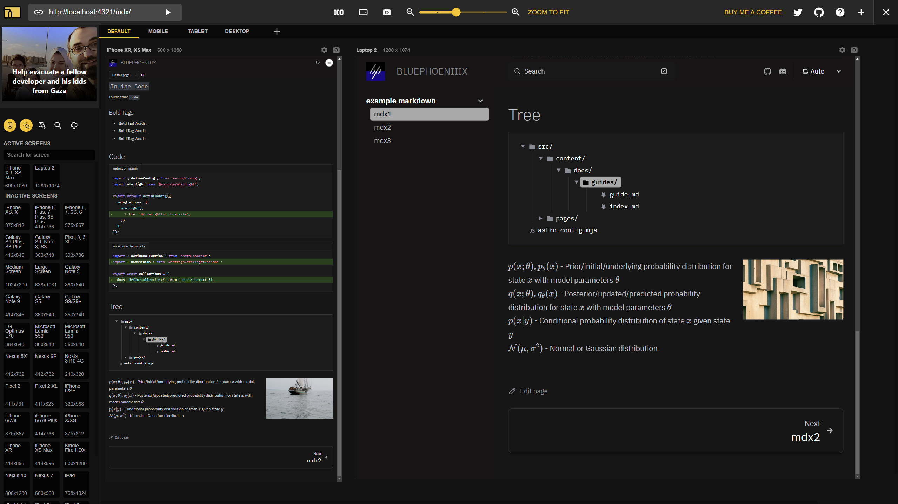
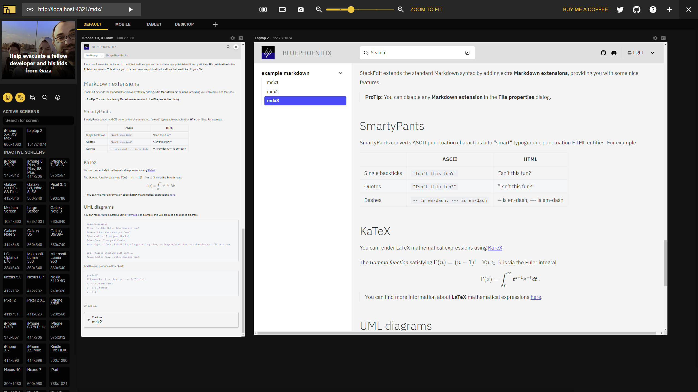

# Astroplex
An optimized theme from Astro Starlight

## Features

### Optimized Typography

- Adjusted widths of main text in central area to make a more compact view effect
- Replacement to IBM Plex fonts families from Roboto
- Minor adjustment to phone's viewports

### Optimized Theme 

- Theme modifications, inspired from IBM Carbon Design Light / Dark Theme

### Optimized Images Layout

- Make 7:3 flex basis layout to paragraph linked image
```js
<section style={{ display: 'flex' }}>
  <div style={{ flexBasis: '70%', paddingRight: '20px' }}>
    <p>
        $p(x;\theta)$, $p_\theta(x)$ - Prior/initial/underlying probability distribution for state $x$ with model parameters $\theta$ <br></br>
        $q(x;\theta)$, $q_\theta(x)$ - Posterior/updated/predicted probability distribution for state $x$ with model parameters $\theta$ <br></br>
        $p(x|y)$ - Conditional probability distribution of state $x$ given state $y$  <br></br>
        $\mathcal{N}(\mu,\sigma^{2})$ - Normal or Gaussian distribution <br></br>
    </p>
  </div>
  <div style={{ flexBasis: '30%' }}>
    
  </div>
</section>
```
- Make more combinations' images layout with  paragraphs (to do)

### Katex Support

- Implement the missing math formular supports from Starlight

### Diagram support (to do)

- Implement the missing diagram support from Starlight

More functionalities are under developing

## Showcases

Showcases taken by [Responsive Viewer](https://chromewebstore.google.com/detail/responsive-viewer/inmopeiepgfljkpkidclfgbgbmfcennb)

### Dark Theme


### Light Theme



## How to use

### Installations && Dev

Inside `install-scripts` folder, enter:

```bash
docker build -t your-image-name .
```

Then:

```bash
docker run -i -t your-image-name /bin/bash
```

Then:

```bash
bash install.sh
```

Then activate nvm env:

```bash
bash
```

After this you can check wether nvm and pnpm are installed or not.

`cd` into `astroplex` folder, type:

```bash 
pnpm install
```
#### Port Forwarding

You probably need Visual Studio Code for Docker Remote Connect, if not, pls modify docker's port forwarding

Open up Visual Studio Code, search Remote Dev and Docker plugin, click instanse then attach to Visual Studio Code

Then `cd` into `docs/` folder, type:

`npm run dev`

Webpage will be rendered under the dev mode.

### Disable Astro Dev Bar

In `docs/` folder, find `packages.json`, replace `dev` options'content into

```bash
npm cache clean --force && astro preferences disable devToolbar && astro dev
```
